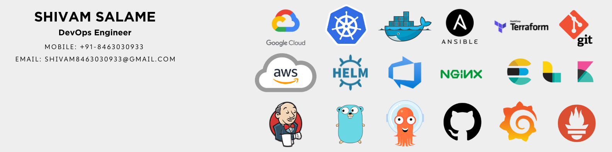

<h1 align="center">Hi 👋 Myself Shivam Salame</h1>
<h3 align="center">DevOps Engineer: Transforming Ideas into Scalable Realities Since 2022 💻 </h3>

- 🌱 Learning **Golang** & Exploring the **Cloud-Native** Ecosystem
- ✉️ Sharing my **DevOps**, Cloud, and Open Source journey through my [blogs](https://linktr.ee/shivamsalame)
- 📚 **Working on Scalable, Fault Tolerant, Optimized and Cost Effective Solutions**

<h3 align="left">Connect with me:</h3>

<!-- ## My Latest Blog Posts 👇 -->
<!-- HASHNODE_BLOG:START -->
<!-- 

<a href="https://www.cloudraft.io/blog/migrating-vms-to-kubernetes-with-kubevirt?utm_source=blog&utm_medium=social&utm_campaign=kubevirt"><strong>Migrating VMs to Kubernetes with Kubevirt</strong></a>
  Hello everyone! 👋 In this blog, we gonna see how KubeVirt is revolutionizing IT infrastructure by seamlessly integrating VM-based workloads into Kubernetes clusters. The blog also explores the challenges of migrating VMs to Kubernetes, the role of KubeVirt in bridging the gap, and practical insights for successful migration.

  

<a href="https://yashpimple.hashnode.dev/securing-the-cloud-a-practical-guide-to-aws-waf-implementation" title="Scaling Your Containers with Amazon ECS and ECR: A Practical Tutorial"><strong>Securing the Cloud: A Practical Guide to AWS WAF Implementation</strong></a>
  Hello everyone! 👋 In this blog we will delve into the realm of AWS WAF & Shield – two formidable weapons in the arsenal of AWS services dedicated to fortifying your digital defenses 
 -->

<!-- HASHNODE_BLOG:END -->
 

<h3 align="left">Languages and Tools:</h3>

 
 
 
 
 

 
 
 

 
 
 
 

  
     
 
  

  
 
    
    
 

    

